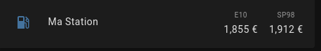

# Intégration Prix Carburant pour Home-Assistant

Récupération du prix des carburant selon les données de https://www.prix-carburants.gouv.fr/
Via une distance maximum du domicile (localisation renseignée dans Home-Assistant) ou via une liste d'ID.

## Installation

### HACS

Non disponible directement actuellement mais par custom repositories- / depots personnalisés

Dans HACS, Integration cliquer sur les trois point, puis depots personnalisés
Ajouter :

- URL : https://github.com/Aohzan/hass-prixcarburant
- Catégorie : Intégration

### Manuelle

Copier le dossier `prix_carburant` dans le dossier `config/custom_components` de votre Home-Assistant.

## Configuration

### via l'interface

Ajoutez une nouvelle intégration, recherchez `Prix Carburant` et remplissez les champs demandés.

### via configuration.yml

#### A partir de la localisation Home-Assistant

Indiquez une distance maximale via `max_km`, par exemple:

```yaml
sensor:
  platform: prix_carburant
  max_km: 10
```

#### A partir d'une liste d'ID

Récupérer l'ID des stations voulues sur https://www.prix-carburants.gouv.fr/. Pour cela chercher la station, cliquer sur le logo station sur la carte, passer le curseur sur `Voir plan` et noter le numéro qui apparait en bas de votre navigateur. Exemple avec Firefox :


Puis dans le fichier configuration.yaml, mettre par exemple :

```yaml
sensor:
  platform: prix_carburant
  stations:
    - 59000009
    - 59000080
```

## Dashboard

Exemple de configuration avec [multiple-entity-row](https://github.com/benct/lovelace-multiple-entity-row):



```yaml
type: entities
entities:
  - entity: sensor.station_mastation_sp98
    type: custom:multiple-entity-row
    name: Ma Station
    show_state: false
    entities:
      - entity: sensor.station_mastation_e10
        name: E10
      - entity: sensor.station_mastation_sp98
        name: SP98
```

### Exemple de données extraites


## Exemples de configuration d'affichage dans Home Assistant

### via carte flex-table-card


```yaml
type: custom:flex-table-card
clickable: true
sort_by: state
max_rows: 15
title: Gasoil
entities:
  include: sensor.station*gazole
columns:
  - name: nom station
    data: name, address
    multi_delimiter: <br />
  - name: dist.
    data: distance
  - name: prix
    data: state
  - name: Valid.
    data: days_since_last_update
    align: right
css:
  tbody tr:nth-child(1): 'color: #00ff00'
  tbody tr:nth-child(15): 'color: #f00020'
style: null
```

### via carte map + auto-entities, dynamique


```yaml
type: custom:auto-entities
card:
  type: map
  show_empty: false
filter:
  template: >
    [  '{{x}}',]
```

### Deux carburants, via vertical-stack + flex-table card avec graphique


```yaml
type: vertical-stack
cards:
  - type: picture
    image: /local/pictures/essence.jpg
  - type: custom:flex-table-card
    clickable: true
    sort_by: state
    max_rows: 5
    entities:
      include: sensor.station*gazole
    columns:
      - name: nom station
        data: name, address
        multi_delimiter: <br />
      - name: dist.
        data: distance
      - name: prix
        data: state
      - name: Valid.
        data: updated_date
        modify: Math.round((Date.now() - Date.parse(x)) / 36000 / 100 /24)
        align: left
        suffix: J
    css:
      tbody tr:nth-child(odd): 'background-color: rgba(255, 255, 255, 0.2)'
      tbody tr:nth-child(even): 'background-color: rgba(255, 255, 255, 0.1)'
      tbody tr:nth-child(1): 'color: #0033ff'
      tbody tr:nth-child(5): 'color: #FF0000'
    card_mod:
      style: |
        ha-card {
        border-radius: 10px;
        padding-bottom: 10px;
        background-color: rgba(0, 0, 0, 0.1)
        }
        :host {
        font-size: 13px;
        border-radius: 10px;
        }
  - type: custom:flex-table-card
    clickable: true
    sort_by: state
    max_rows: 5
    entities:
      include: sensor.station*E85
    columns:
      - name: nom station
        data: name, address
        multi_delimiter: <br />
      - name: dist.
        data: distance
      - name: prix
        data: state
      - name: Valid.
        data: updated_date
        modify: Math.round((Date.now() - Date.parse(x)) / 36000 / 100 /24)
        align: left
        suffix: J
    css:
      tbody tr:nth-child(odd): 'background-color: rgba(255, 255, 255, 0.2)'
      tbody tr:nth-child(even): 'background-color: rgba(255, 255, 255, 0.1)'
      tbody tr:nth-child(1): 'color: #0033ff'
      tbody tr:nth-child(5): 'color: #FF0000'
    card_mod:
      style: |
        ha-card {
        border-radius: 10px;
        background-color: rgba(0, 0, 0, 0.1)
        }
        :host {
        font-size: 13px;
        border-radius: 10px;
        }
card_mod:
  style: |
    ha-card {
     --ha-card-background: rgba(0, 0, 0, 0.1);
    ha-card {
      margin-top: 0em;
        }         
```

## Crédits

Merci à https://github.com/max5962/prixCarburant-home-assistant
