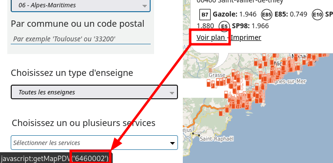

# Intégration Prix Carburant pour Home-Assistant

Récupération du prix des carburant selon les données de https://www.prix-carburants.gouv.fr/


## Installation

Copier le dossier `prix_carburant` dans le dossier `config/custom_components` de votre Home-Assistant.

## Configuration

Récupérer l'ID des stations voulues sur https://www.prix-carburants.gouv.fr/. Pour cela chercher la station, cliquer sur le logo station sur la carte, passer le curseur sur `Voir plan` et noter le numéro qui apparait en bas de votre navigateur. Exemple avec Firefox :



Puis dans le fichier configuration.yaml, mettre par exemple :

```yaml
sensor:
  platform: prix_carburant
  stations:
    - 59000009
    - 59000080
```

## TODO

- Ajouter la récupération automatique des stations via la localisation configurée dans Home-Assistant
- Configuration depuis l'UI

## Crédits

Fork de https://github.com/max5962/prixCarburant-home-assistant
